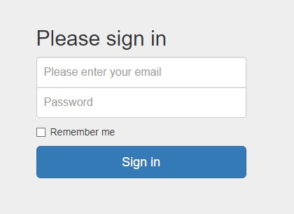
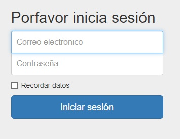

# DOM

En JavaScript es posible manipular el DOM, resulta ser bastante interesante para agregar interactividad a los sitios web.

A día de hoy existen dos disyuntivas respecto a la manipulación del DOM, hacerlo mediante **Vanilla JavaScript** que es lo que se verá a continuación o hacerlo mediante JQuery. Manejar correctamente la interactividad con el DOM es probablemente una de las habilidades más importantes y útiles para un desarrollador web.


**Escribir texto en el DOM**:

```js
document.write("texto")
```

> La desventaja de este comando es que no genera una etiqueta en DOM como tal, si no que simplemente inyecta texto. Por defecto lo inyecta al final del documento.

**Seleccionar elementos:**

```js
const contact = document.getElementById('contact')
const nav = document.getElementsByClassName('navigator')
const h1 = document.getElementsByTagName('h1')[0]
```

**Seleccionar elemento y aplicar estilos:**

```js
const title = document.querySelector('.title')
title.style.backgroundColor = 'red'
```

> `querySelector` nos permite seleccionar un elemento y manejar múltiples estilos con el.

**Añadir estilo:**

```js
const addStyle = document.getElementsByTagName('h1')[0]
addStyle.classList.add('alert')
```

**Remover estilo:**

```js
const rmStyle = document.getElementsByTagName('h1')[0]
rmStyle.classList.remove('border')
```

**Añadir evento de clic:**

```js
const boton = document.getElementById('button')
boton.addEventListener('click', () => boton.classList.toggle('alert'))
```

**Generar etiqueta**:

```js
const header = document.createElement('h1') // 1.
const div = document.getElementById('contenedor') // 2.
const texto = document.createTextNode("TEXTO") // 3.
header.appendChild(texto) // 4.
contenedor.appendChild(header) // 5.
```

> 1. Generamos el elemento
> 2. Seleccionamos donde será introducido.
> 3. Generamos contenido.
> 4. Añadimos el contenido a la etiqueta generada.
> 5. Cargamos la etiqueta en elemento que seleccionamos.


**GENERAR SPAN EN FORMULARIO CON CONDICIONES**

**Función para generar alerta:**

```js
	function alertar(mensaje, elem) {
		var span = elem.parentNode.children[2];  // Seleccionamos el lugar del span.
		if (!span) { // si span no existe se crea.
			var span = document.createElement('span'); // Creamos la etiqueta span.
		}
		span.innerHTML = mensaje; // Añadimos el mensaje de error al span.
		elem.parentNode.appendChild(span); // Añadimos el span.
	}
```

**Función para remover span:**

```js
	function quitar_span(elem) {
		var span = elem.parentNode.children[2]; // Seleccionamos el lugar del span.
		if (!span) { // Si el span no existe escapamos.
			return;
		}
		elem.parentNode.removeChild(span); // Eliminamos el span del lugar.
	}
```

**Seleccionamos los inputs del formulario:**

```js
	var name = document.getElementById('name');
	var lastname = document.getElementById('lastname');
	var email = document.getElementById('input-email');
	var password = document.getElementById('input-password');
```

**Configuramos las validaciones:**

Las validaciones son que los campos no deben estar vacíos, el nombre y el apellido debe comenzar por mayúscula y solo contener letras. La contraseña debe ser mayor a seis elementos.

```js
	if (name.value.length == 0) {
		alertar('Debe escribir un nombre', name);
	} 
	else if (!name.value.match(/^[a-zA-Z]+$/)) {
		alertar('Debe ingresar puras letras', name);
	} 
	else if (name.value[0] != name.value[0].toUpperCase()) {
		alertar('Nombre debe comenzar con mayúsculas', name);
	} 
	else{
		quitar_span(name)
	}

	if (lastname.value.length == 0) {
		alertar('Debe escribir un nombre', lastname);
	} 
	else if (!lastname.value.match(/^[a-zA-Z]+$/)) {
		alertar('Debe ingresar puras letras', lastname);
	} 
	else if (lastname.value[0] != lastname.value[0].toUpperCase()) {
		alertar('Nombre debe comenzar con mayúsculas', lastname);
	} 
	else{
		quitar_span(lastname)
	}

	if (email.value.length == 0) {
		alertar('Debe escribir un correo', email);
	}
	else{
		quitar_span(email)
	}

	if (password.value.length == 0) {
		alertar('Debe escribir una contraseña', password);
	}
	else if(password.value.length < 6){
		alertar('La contraseña debe ser mayor o igual a 6 caracteres', password)
	}
	else if(password.value == "password" || password.value == "123456" || password.value == "654321"){
		alertar('La contraseña debe ser más fuerte', password)
	}
	else{
		quitar_span(password)
	}
```


**Modificar campos:**



```js
var texto = document.getElementById("form-signin-heading")
var firstname = document.getElementById("name")
var lastname = document.getElementById("lastname")
var check = document.getElementById("recuerda")
var boton = document.getElementById("boton")

texto.innerText = "Porfavor inicia sesión"
firstname.placeholder = "Correo electronico"
lastname.placeholder = "Contraseña"
recuerda.innerText = "Recordar datos"
boton.innerText = "Iniciar sesión"
```




**GENERAR MENSAJES EN UN CHAT**:


**Definimos la función para añadir mensajes:**

```js
function addMessage(){
  var message = document.getElementById("mensajes");
  var chat = document.getElementById("chat");
  if(mensajes.value == ""){
    return
  }

  /* Creamos los elementos que se generaran */
  var message_out = document.createElement("div");
  message_out.className = 'w-message-out w-message';

  var message_text = document.createElement("div");
  message_text.className = 'w-message-text';

  var text_chat = document.createElement("p");
  text_chat.innerHTML = message.value;
  
  /* configuramos la hora */
  var time = document.createElement("div");
  var d = new Date();
  time.className = 'time';
  time.innerHTML = d.getHours() + ":" + d.getMinutes();

  
  /* Añadir valores al mensaje de salida y al chat */
  message_text.appendChild(text_chat);
  message_text.appendChild(time);
  message_out.appendChild(message_text);
  chat.appendChild(message_out);
  chat.scrollTop = chat.scrollHeight;
  message.value = "";
}
```

**Configuramos enviar el mensaje al hacer clic al icono y al presionar enter:**

```js
var boton = document.getElementsByClassName('icon-mic')[0]
boton.addEventListener('click', addMessage)
mensajes.addEventListener('keyup', (ev) =>{
  if(ev.keyCode != 13) {
    return;
}
  else{
    addMessage()
  }
});
```

